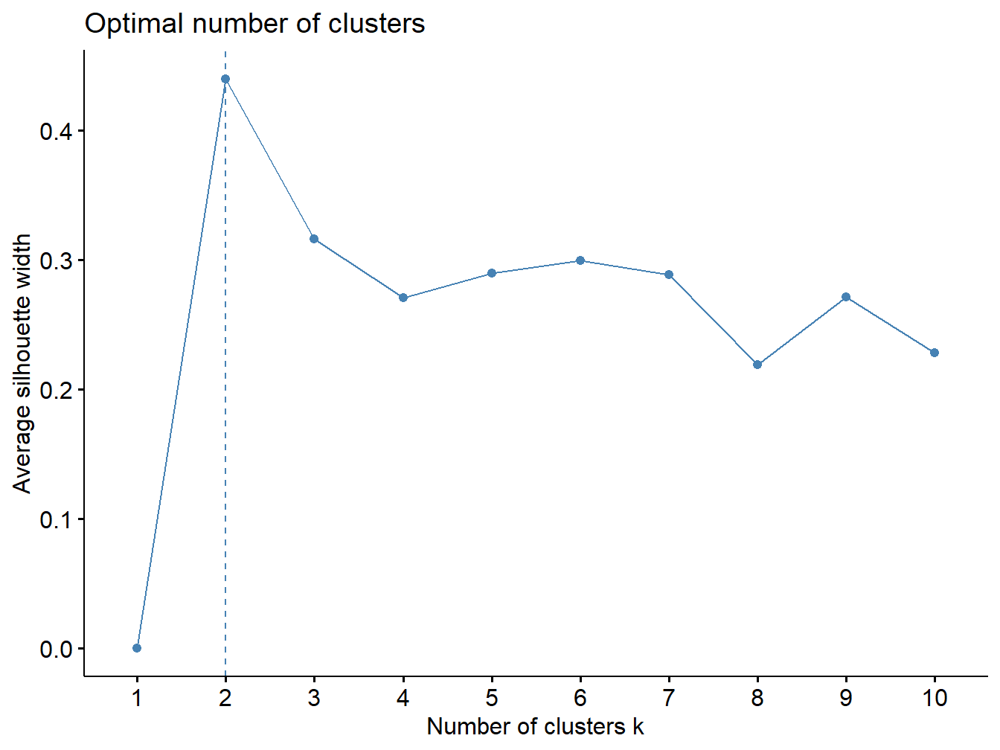
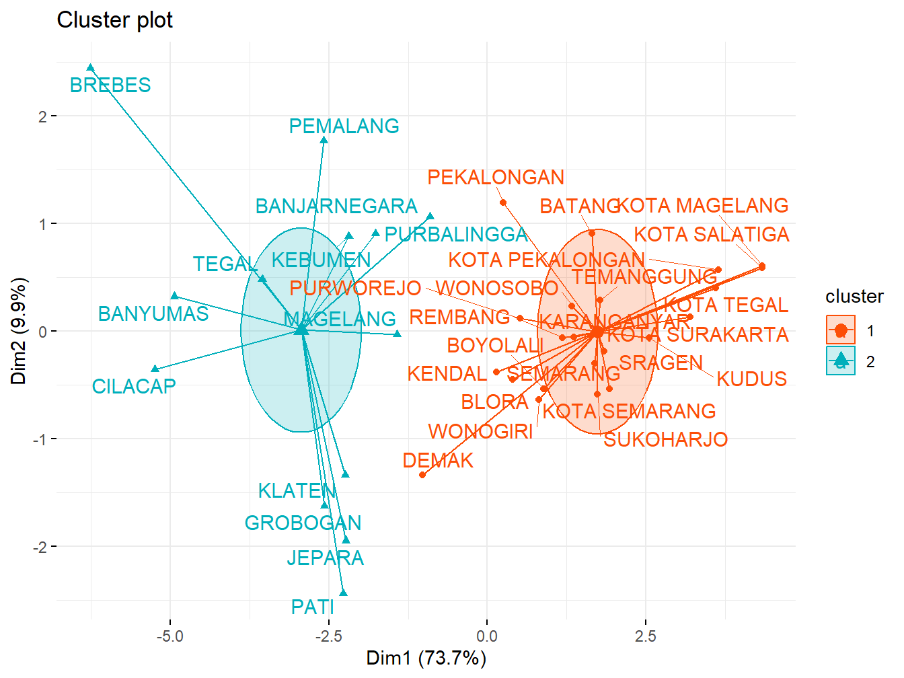

# Algoritma K-Means

```{=html}
<style>
body{
text-align: justify}
</style>
```

## Pengantar Algoritam K-Means
K-means merupakan salah satu metode hard partition yang banyak digunakan untuk pengelompokan data. Algoritma K-means adalah dasar pengelompokan metode partisi yang dipublikasikan oleh Lloyd dari Bell Telephone Laboratories pada tahun 1957. Penelitian pada K-means dapat ditelusuri kembali ke pertengahan abad yang lalu, yang dilakukan oleh berbagai peneliti diseluruh disiplin ilmu yang berbeda terutama oleh Lloyd (1957), Forgey (1965), Friedman dan Robin (1967) dan MacQueen (1967). K-means dapat didefinisikan sebagai algoritma klastering yang mengelompokan data ke dalam k klaster berdasarkan jarak terdekat data dengan pusat klaster. Algoritma K-means sangat efisien untuk mengelompokan dataset yang besar, kemudahan dalam pengaplikasiannya dan metode yang efisien dalam hal komputasi, menjadi alasan utama popularitas K-means, meskipun telah diusulkan lebih dari 50 tahun yang lalu.

Algoritma K-means mengelompokan objek ke dalam kelompok sehingga objek dalam satu klaster memiliki kemiripan yang tinggi dibandingkan dengan objek di dalam klaster yang berbeda. K-means dimulai dengan menentukan jumlah klaster sebanyak k, kemudian membangkitkan k pusat klaster secara acak. Selanjutnya setiap objek akan dikelompokan berdasarkan jarak terdekat dengan pusat klaster, pusat klaster diperbaharui berdasarkan titik data dalam setiap klaster. Proses ini diulangi sampai kriteria konvergen terpenuhi. Berikut ini adalah tahapan dari algoritma K-means:

1.  Menentukan nilai k sebagai jumlah klaster yang dibentuk.

2.  Memilih k pusat klaster secara acak untuk menjadi pusat klaster awal.

3.  Alokasikan semua data ke pusat klaster terdekat dengan matrik jarak.

4.  Hitung kembali pusat klaster baru berdasarkan data yang mengikuti klaster masing-masing.

5.  Ulangi langkah 3 dan 4 hingga kondisi konvergen tercapai atau tidak ada data yang berpindah dari satu klaster ke klaster yang lainnya.

## Eksperimen Algoritma K-Means

Pada eksprimen ini algoritma K-Means akan digunakan untuk mengelompokan data kemiskinan di Jawa Tengah yang diambil dari website Tim Percepatan Penanggulangan Kemiskinan [(TNP2K)](https://www.tnp2k.go.id/)

### Data

Package `reader` menyiapkan fungsi [`read_csv()`](https://readr.tidyverse.org/reference/read_delim.html) untuk import data dari file CSV. Pada kasus ini digunakan data [Data 40% Kemiskinan di jawa Tengah](https://github.com/dedenistiawan/Dataset/blob/main/BDT.csv).


``` r
library (readr)
urlfile = "https://raw.githubusercontent.com/dedenistiawan/Dataset/main/Basis%20Data%20Terpadu%20Jateng.csv"

data<-read.csv(url(urlfile), row.names = "Kabupaten")
```


``` r
knitr::kable(
  head(data, 10), caption = 'Basis Data Terpadu Jawa Tengah',
  booktabs = TRUE)
```


Table: (\#tab:nice-tab)Basis Data Terpadu Jawa Tengah

                  X1     X2     X3     X4     X5     X6      X7     X8     X9    X10
-------------  -----  -----  -----  -----  -----  -----  ------  -----  -----  -----
CILACAP         5.19   5.67   5.08   5.44   5.22   6.05   11.47   9.78   5.55   5.12
BANYUMAS        5.71   4.47   5.18   5.51   5.02   6.21    7.39   6.96   5.98   8.22
PURBALINGGA     3.30   2.19   3.80   3.13   3.73   3.34    8.71   7.41   3.21   4.65
BANJARNEGARA    2.73   2.34   3.76   2.80   2.57   2.99    3.31   5.45   4.21   6.05
KEBUMEN         4.17   2.55   3.26   4.16   3.15   4.15    4.30   9.29   4.61   4.34
PURWOREJO       1.87   2.12   1.48   3.05   1.78   1.83    5.00   4.90   3.12   2.09
WONOSOBO        2.13   1.95   3.00   1.78   1.62   2.06    0.45   2.32   3.57   0.84
MAGELANG        3.95   3.01   4.22   4.15   3.01   3.64    1.44   3.35   5.69   3.67
BOYOLALI        2.19   3.07   1.61   2.74   2.11   1.82    1.71   2.34   3.41   1.55
KLATEN          3.84   5.15   1.93   4.64   4.04   3.78    8.71   4.45   3.99   3.09

### Memeriksa Missing Value


``` r
colSums(is.na(data))
```

```
##  X1  X2  X3  X4  X5  X6  X7  X8  X9 X10 
##   0   0   0   0   0   0   0   0   0   0
```

Hasil output di atas menunjukan bahwa tidak *missing value* di semua variabel

### Visualisasi Matriks jarak


``` r
#Plot Disatance
library(ggplot2)
library(factoextra)
distance <- get_dist(data)
fviz_dist(distance, gradient = list(low = "#00AFBB", mid = "white", high = "#FC4E07"))
```

<div class="figure" style="text-align: center">

<p class="caption">(\#fig:unnamed-chunk-2)Matrik Jarak</p>
</div>

Matriks jarak ini berfungsi untuk mengukur jarak antar variabel, semakin merah warnanya maka semakin jauh jarak antar variabel dan semakin biru semakin dekat jarak antar variabel.

### Estimasi Jumlah *Cluster* Optimal
Dalam metode k-means banyaknya klaster ditentukan sendiri oleh pengguna. Maka dari itu perlu dicari jumlah klaster yang optimum yang dapat mengelompokkan objek dengan baik (Perlu diketahui bahwa metode ini relatif subjektif). Salah satu metode yang digunakan adalah Elbow Plot. Elbow Plot merupakan plot antara banyak klaster dengan total within-cluster variation (total dari simpangan per kluster). Banyak klaster yang dipilih adalah bagian “siku” atau titik dimana terdapat penurunan yang tajam sebelum titik tersebut dan disusul penurunan yang tidak tajam setelah titik tersebut. Hal ini karena penambahan jumlah klaster tidak membawa pengaruh banyak atas variasi yang ada di dalam klaster tersebut.

### Membuat Plot *Cluster*
Jumlah klaster yang dibentuk mulai dari 2 sampai 5, untuk melihat sebaran data pada masing-masing *cluster*


``` r
#use several different values of k
k2 <- kmeans(data, centers = 2, nstart = 25)
k3 <- kmeans(data, centers = 3, nstart = 25)
k4 <- kmeans(data, centers = 4, nstart = 25)
k5 <- kmeans(data, centers = 5, nstart = 25)
```


``` r
# plots to compare
p1 <- fviz_cluster(k2, geom = "point", data = data) + ggtitle("k = 2")
p2 <- fviz_cluster(k3, geom = "point",  data = data) + ggtitle("k = 3")
p3 <- fviz_cluster(k4, geom = "point",  data = data) + ggtitle("k = 4")
p4 <- fviz_cluster(k5, geom = "point",  data = data) + ggtitle("k = 5")
```


``` r
library(gridExtra)
grid.arrange(p1, p2, p3, p4, nrow = 2)
```

<div class="figure" style="text-align: center">

<p class="caption">(\#fig:unnamed-chunk-5)Plot Jumlah Cluster</p>
</div>

### Metode Elbow
Metode Elbow merupakan suatu metode yang digunakan untuk menghasilkan informasi dalam menentukan jumlah cluster terbaik dengan cara melihat persentase hasil perbandingan antara jumlah cluster yang akan membentuk siku pada suatu titik. Metode ini memberikan ide/gagasan dengan cara memilih nilai cluster dan kemudian menambah nilai cluster tersebut untuk dijadikan model data dalam penentuan cluster terbaik. Dan selain itu persentase perhitungan yang dihasilkan menjadi pembanding antara jumlah cluster yang ditambah. Hasil persentase yang berbeda dari setiap nilai cluster dapat ditunjukan dengan menggunakan grafik sebagai sumber informasinya. Jika nilai cluster pertama dengan nilai cluster kedua memberikan sudut dalam grafik atau nilainya mengalami penurunan paling besar maka nilai cluster tersebut yang terbaik.


``` r
#Determining number Optimal Clusters
##Elbow Method
library(ggplot2)
library(factoextra)
fviz_nbclust(data, kmeans, method = "wss") +
  geom_vline(xintercept = 2, linetype = 2)
```

<div class="figure" style="text-align: center">

<p class="caption">(\#fig:unnamed-chunk-6)Plot Jumlah Cluster Metode Elbow</p>
</div>

Metode elbow menggunakan nilai total wss (whitin sum square) sebagai penentu 𝐾 optimalnya. Dari gambar di atas terlihat garis mengalami patahan yang membentuk elbow atau siku pada saat 𝐾 = 2. Maka dengan menggunakan metode ini diperoleh 𝐾 optimal pada saat berada di 𝐾 = 2.

### Metode Silhouette
Silhouette Coefficient digunakan untuk melihat kualitas dan kekuatan cluster, seberapa baik suatu objek ditempatkan dalam suatu cluster. Metode ini merupakan gabungan dari metode cohesion dan separation.


``` r
##Average Silhouette Method
fviz_nbclust(data, kmeans, method = "silhouette")
```

<div class="figure" style="text-align: center">

<p class="caption">(\#fig:unnamed-chunk-7)Plot Jumlah Cluster Metode silhouette</p>
</div>

Pendekatan rata-rata nilai metode silhouette untuk menduga kualitas dari klaster yang terbentuk. Semakin tinggi nilai rata-ratanya maka akan semakin baik. Berdasarkan grafik pada gambar di atas banyak klaster optimal yang terbentuk pada  𝐾 = 2.

### Eksperimen K-Means Clustering
Dari pendekatan metode elbow dan metode Silhouette di dapatkan jumlah *cluster* optimal adalah K=2. setelah ini dilakukan eksperimen jumlah K=2

``` r
#Computing k-means clustering
#Compute k-means with k = 2
set.seed(123)
km.res <- kmeans(data, 2, nstart = 25)
# Print the results
print(km.res)
```

```
## K-means clustering with 2 clusters of sizes 22, 13
## 
## Cluster means:
##         X1       X2       X3       X4       X5       X6       X7
## 1 1.918182 2.017273 1.675000 1.949091 1.890455 1.728182 1.557273
## 2 4.446923 4.276923 4.854615 4.394615 4.494615 4.769231 5.056154
##         X8       X9      X10
## 1 1.286818 1.952727 1.455455
## 2 5.515385 4.389231 5.230000
## 
## Clustering vector:
##         CILACAP        BANYUMAS     PURBALINGGA    BANJARNEGARA 
##               2               2               2               2 
##         KEBUMEN       PURWOREJO        WONOSOBO        MAGELANG 
##               2               1               1               2 
##        BOYOLALI          KLATEN       SUKOHARJO        WONOGIRI 
##               1               2               1               1 
##     KARANGANYAR          SRAGEN        GROBOGAN           BLORA 
##               1               1               2               1 
##         REMBANG            PATI           KUDUS          JEPARA 
##               1               2               1               2 
##         DEMAK          SEMARANG      TEMANGGUNG          KENDAL 
##               1               1               1               1 
##          BATANG      PEKALONGAN        PEMALANG           TEGAL 
##               1               1               2               2 
##          BREBES   KOTA MAGELANG  KOTA SURAKARTA   KOTA SALATIGA 
##               2               1               1               1 
##   KOTA SEMARANG KOTA PEKALONGAN      KOTA TEGAL 
##               1               1               1 
## 
## Within cluster sum of squares by cluster:
## [1] 262.6536 466.0163
##  (between_SS / total_SS =  51.3 %)
## 
## Available components:
## 
## [1] "cluster"      "centers"      "totss"        "withinss"    
## [5] "tot.withinss" "betweenss"    "size"         "iter"        
## [9] "ifault"
```

Melihat hasil *cluster* akhir pada setiap kabupaten

``` r
# Cluster number for each of the observations
km.res$cluster
```

```
##         CILACAP        BANYUMAS     PURBALINGGA    BANJARNEGARA 
##               2               2               2               2 
##         KEBUMEN       PURWOREJO        WONOSOBO        MAGELANG 
##               2               1               1               2 
##        BOYOLALI          KLATEN       SUKOHARJO        WONOGIRI 
##               1               2               1               1 
##     KARANGANYAR          SRAGEN        GROBOGAN           BLORA 
##               1               1               2               1 
##         REMBANG            PATI           KUDUS          JEPARA 
##               1               2               1               2 
##         DEMAK          SEMARANG      TEMANGGUNG          KENDAL 
##               1               1               1               1 
##          BATANG      PEKALONGAN        PEMALANG           TEGAL 
##               1               1               2               2 
##          BREBES   KOTA MAGELANG  KOTA SURAKARTA   KOTA SALATIGA 
##               2               1               1               1 
##   KOTA SEMARANG KOTA PEKALONGAN      KOTA TEGAL 
##               1               1               1
```

Melihat jumlah anggota *cluster*

``` r
# Cluster size
km.res$size
```

```
## [1] 22 13
```

### Visualisasi Hasil *clustering*

``` r
# Cluster means
km.res$centers
```

```
##         X1       X2       X3       X4       X5       X6       X7
## 1 1.918182 2.017273 1.675000 1.949091 1.890455 1.728182 1.557273
## 2 4.446923 4.276923 4.854615 4.394615 4.494615 4.769231 5.056154
##         X8       X9      X10
## 1 1.286818 1.952727 1.455455
## 2 5.515385 4.389231 5.230000
```

``` r
fviz_cluster(km.res, data = data)
```

<div class="figure" style="text-align: center">

<p class="caption">(\#fig:unnamed-chunk-11)Plot Hasil Cluster</p>
</div>


``` r
fviz_cluster(km.res, data = data,
             palette = c("#FC4E07", "#00AFBB"),
             ellipse.type = "euclid", # Concentration ellipse
             star.plot = TRUE, # Add segments from centroids to items
             repel = TRUE, # Avoid label overplotting (slow)
             ggtheme = theme_minimal())
```

<div class="figure" style="text-align: center">

<p class="caption">(\#fig:unnamed-chunk-12)Plot Hasil Cluster</p>
</div>

