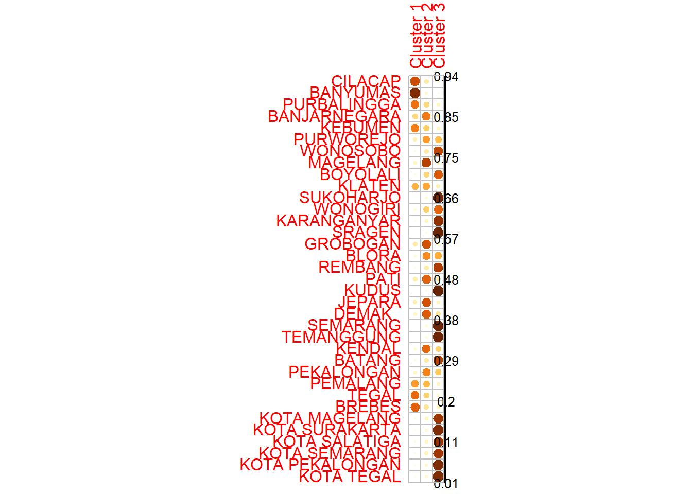
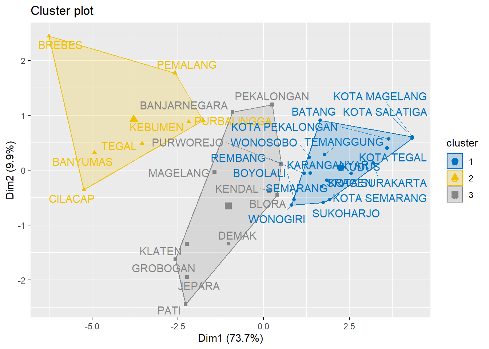
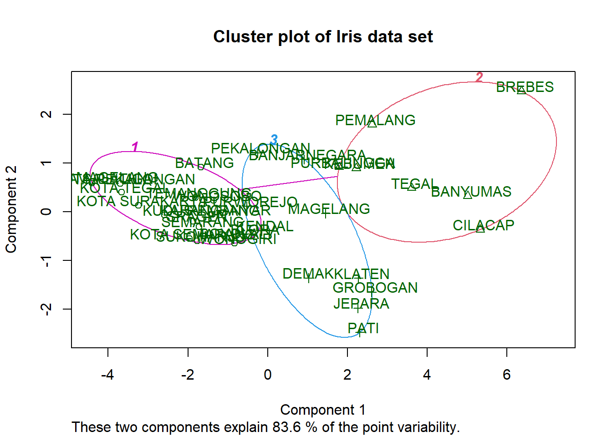

# Algoritma Fuzzy C-Means

## Pengantar Algoritma Fuzzy C-Means

```{=html}
<style>
body{
text-align: justify}
</style>
```
Fuzzy c-means merupakan metode yang dikenal baik dalam mendeteksi klaster [@pimentel2016]. Metode ini menggunakan model pengelompokan fuzzy sehingga data dapat menjadi anggota dari semua kelas atau klaster terbentuk dengan derajat atau tingkat keanggotaan yang berbeda antara 0 hingga 1. Tingkat keberadaan data dalam suatu kelas atau klaster ditentukan oleh derajat keanggotaannya. Kelebihan dari metode ini adalah penempatan pusat klaster yang lebih tepat dibandingkan dengan metode lain. Caranya adalah dengan memperbaiki pusat klaster secara berulang, maka akan dapat dilihat bahwa pusat klaster akan bergerak menuju lokasi yang tepat (Wijaya, 2014). Namun, pada algoritma Fuzzy c-means dibutuhkan waktu komputasi yang lama [@stetco2015].

Klastering dengan algoritma Fuzzy C-Means didasarkan pada teori logika fuzzy yang diperkenalkan oleh Lotfi Zadeh pada tahun 1965 dengan nama himpunan fuzzy (fuzzy set). Fuzzy C-Means Clustering pertama kali diperkenalkan oleh Dun pada (1973) dan diperbaiki oleh Bezdek [@bezdek1984]. Dalam teori fuzzy, keangotaan sebuah data diberikan dengan suatu nilai derajat keanggotaan yang jangkauan nilainya 0 sampai 1. Semakin tinggi nilai derajat keanggotaannya maka semakin tinggi nilai keanggotaan sebuah data dalam suatu kelompok dan semakin kecil nilai derajat keanggotaannya maka semakin rendah nilai keanggotaan sebuah data dalam suatu kelompok.

Asumsikan terdapat sejumlah data dalam dataset $X$ yang berisi $n$ data yang 
dinotasikan $X={x_1,x_2, …,x_n}$, dimana setiap data mempunyai fitur $r$ dimensi: $x_{i1}, x_{i2}, ..., x_{ir}$, dinotasikan $x_i={x_i1, x_i2, ..., x_ir}$. Ada sejumlah klaster $C$ dengan centroid: $C_1, C_2, ..., C_k$, dimana $k$ adalah jumlah klaster. Setiap data mempunyai derajat keanggotaan pada setiap klaster, dinyatakan dengan $u_{ij}$, dengan nilai diantara 0 dan 1, $i$ menyatakan data $x_i$ dan $j$ menyatakan klaster $c_j$. Jumlah nilai derajat keanggotaan setiap data $x_i$ selalu sama dengan 1, yang diformulasikan pada persamaan berikut:

::: {.theorem #unnamed-chunk-1}
$$\sum_{j=1}^k u_{i j}=1$$
:::

Fuzzy c-means clustering merupakan suatu metode clustering yang hampir mirip seperti k-means clustering. Karena metode clustering ini mirip dengan k-means clustering, ada yang menyebut metode ini fuzzy k-means clustering. Fuzzy c-means merupakan salah satu jenis soft clustering dimana dalam mengelompokan suatu data, setiap data bisa dimiliki lebih dari satu cluster.

Cara kerja dari fuzzy c-means clustering dalam mengelompokkan datanya adalah sebagai berikut :

1.  Menentukan banyak cluster (k) yang akan dibuat.

2.  Menentukan nilai proporsi untuk setiap data poin secara random untuk masuk dalam suatu cluster. Menghitung nilai centroid.

3.  Dalam menghitung nilai centroid, kita menggunakan formula berikut:

::: {.lemma #unnamed-chunk-2}
$$C_j=\frac{\sum{{\mu }^m_{ij}}x}{\sum{{\mu }^m_{ij}}}$$
:::

4.  Menghtung kembali nilai proporsi untuk setiap data poin untuk masuk pada setiap cluster. formula yang digunakan yaitu sebagai berikut:

::: {.lemma #unnamed-chunk-3}
$${\mu }^m_{ij}=\frac{1}{\sum{{\left(\frac{\left|x_i-c_j\right|}{\left|x_i-c_k\right|}\right)}^{\frac{2}{m-1}}}}$$
:::

## Eksperimeen Fuzzy C-Means

### Install dan Load Packagaes


``` r
library(ppclust)
library(factoextra)
library(fclust)
library(cluster)
```

### Data


``` r
library (readr)
urlfile = "https://raw.githubusercontent.com/dedenistiawan/Dataset/main/Basis%20Data%20Terpadu%20Jateng.csv"

data<-read.csv(url(urlfile), row.names = "Kabupaten")
```

### Hasil Clustering


``` r
library(ppclust)
```

```
## Warning: package 'ppclust' was built under R version 4.4.1
```

``` r
res.fcm <- fcm(data, centers=3)
as.data.frame(res.fcm$u)
```

```
##                  Cluster 1  Cluster 2  Cluster 3
## CILACAP         0.19959671 0.09432155 0.70608174
## BANYUMAS        0.09071562 0.03242738 0.87685700
## PURBALINGGA     0.28641412 0.12503329 0.58855259
## BANJARNEGARA    0.56797934 0.15770912 0.27431153
## KEBUMEN         0.32490172 0.12183017 0.55326811
## PURWOREJO       0.46825795 0.37665821 0.15508384
## WONOSOBO        0.21208577 0.73997169 0.04794255
## MAGELANG        0.75569090 0.12565978 0.11864932
## BOYOLALI        0.29335751 0.65917928 0.04746322
## KLATEN          0.44008300 0.15366683 0.40625017
## SUKOHARJO       0.07528219 0.90659203 0.01812578
## WONOGIRI        0.31366262 0.62649398 0.05984340
## KARANGANYAR     0.13567704 0.83280963 0.03151333
## SRAGEN          0.05643609 0.92987167 0.01369224
## GROBOGAN        0.68584478 0.10906165 0.20509357
## BLORA           0.51050938 0.42364979 0.06584083
## REMBANG         0.18988443 0.77496097 0.03515460
## PATI            0.63754615 0.18226626 0.18018760
## KUDUS           0.04642043 0.93999864 0.01358093
## JEPARA          0.69208387 0.13357477 0.17434136
## DEMAK           0.65516864 0.22405973 0.12077163
## SEMARANG        0.06180543 0.92443899 0.01375558
## TEMANGGUNG      0.06302723 0.92181846 0.01515432
## KENDAL          0.62112953 0.30783534 0.07103512
## BATANG          0.20285008 0.74568211 0.05146780
## PEKALONGAN      0.54367557 0.33879435 0.11753007
## PEMALANG        0.39383397 0.13508254 0.47108349
## TEGAL           0.30162583 0.08391671 0.61445746
## BREBES          0.23941019 0.11958050 0.64100931
## KOTA MAGELANG   0.12644712 0.82227544 0.05127744
## KOTA SURAKARTA  0.08663885 0.88284897 0.03051218
## KOTA SALATIGA   0.12550332 0.82356236 0.05093432
## KOTA SEMARANG   0.14670134 0.81177689 0.04152177
## KOTA PEKALONGAN 0.08784985 0.87988142 0.03226874
## KOTA TEGAL      0.08711147 0.88100104 0.03188749
```


``` r
# Visualize using corrplot
library(corrplot)
```

```
## Warning: package 'corrplot' was built under R version 4.4.1
```

```
## corrplot 0.95 loaded
```

``` r
corrplot(res.fcm$u, is.corr = FALSE)
```




``` r
res.fcm$v0
```

```
##             X1   X2   X3   X4   X5   X6    X7   X8   X9  X10
## Cluster 1 3.29 1.36 4.27 2.11 2.40 3.06  2.97 2.65 1.90 3.66
## Cluster 2 1.52 1.69 1.59 1.68 1.91 1.39  0.37 0.13 0.86 0.52
## Cluster 3 5.19 5.67 5.08 5.44 5.22 6.05 11.47 9.78 5.55 5.12
```


``` r
res.fcm$v
```

```
##                 X1       X2       X3       X4       X5       X6
## Cluster 1 3.418238 4.025821 3.497306 3.657048 3.843888 3.477061
## Cluster 2 1.724771 1.743303 1.432408 1.706002 1.626688 1.504833
## Cluster 3 5.001721 4.041093 5.531054 4.669414 4.638562 5.500335
##                 X7       X8       X9      X10
## Cluster 1 3.074419 3.057133 3.802309 3.529256
## Cluster 2 1.335312 1.021470 1.697120 1.056498
## Cluster 3 6.458007 7.009924 4.458629 6.474407
```

### Hasil Clustering FCM


``` r
summary(res.fcm)
```

```
## Summary for 'res.fcm'
## 
## Number of data objects:  35 
## 
## Number of clusters:  3 
## 
## Crisp clustering vector:
##  [1] 3 3 3 1 3 1 2 1 2 1 2 2 2 2 1 1 2 1 2 1 1 2 2 1 2 1 3 3 3 2 2 2
## [33] 2 2 2
## 
## Initial cluster prototypes:
##             X1   X2   X3   X4   X5   X6    X7   X8   X9  X10
## Cluster 1 3.29 1.36 4.27 2.11 2.40 3.06  2.97 2.65 1.90 3.66
## Cluster 2 1.52 1.69 1.59 1.68 1.91 1.39  0.37 0.13 0.86 0.52
## Cluster 3 5.19 5.67 5.08 5.44 5.22 6.05 11.47 9.78 5.55 5.12
## 
## Final cluster prototypes:
##                 X1       X2       X3       X4       X5       X6
## Cluster 1 3.418238 4.025821 3.497306 3.657048 3.843888 3.477061
## Cluster 2 1.724771 1.743303 1.432408 1.706002 1.626688 1.504833
## Cluster 3 5.001721 4.041093 5.531054 4.669414 4.638562 5.500335
##                 X7       X8       X9      X10
## Cluster 1 3.074419 3.057133 3.802309 3.529256
## Cluster 2 1.335312 1.021470 1.697120 1.056498
## Cluster 3 6.458007 7.009924 4.458629 6.474407
## 
## Distance between the final cluster prototypes
##           Cluster 1 Cluster 2
## Cluster 2  42.66853          
## Cluster 3  48.57171 165.71763
## 
## Difference between the initial and final cluster prototypes
##                   X1          X2         X3          X4         X5
## Cluster 1  0.1282382  2.66582102 -0.7726942  1.54704839  1.4438885
## Cluster 2  0.2047706  0.05330275 -0.1575916  0.02600226 -0.2833119
## Cluster 3 -0.1882786 -1.62890655  0.4510540 -0.77058553 -0.5814383
##                   X6         X7         X8         X9        X10
## Cluster 1  0.4170614  0.1044191  0.4071326  1.9023093 -0.1307443
## Cluster 2  0.1148330  0.9653120  0.8914704  0.8371205  0.5364979
## Cluster 3 -0.5496647 -5.0119928 -2.7700760 -1.0913711  1.3544068
## 
## Root Mean Squared Deviations (RMSD): 4.435041 
## Mean Absolute Deviation (MAD): 93.29115 
## 
## Membership degrees matrix (top and bottom 5 rows): 
##               Cluster 1  Cluster 2 Cluster 3
## CILACAP      0.19959671 0.09432155 0.7060817
## BANYUMAS     0.09071562 0.03242738 0.8768570
## PURBALINGGA  0.28641412 0.12503329 0.5885526
## BANJARNEGARA 0.56797934 0.15770912 0.2743115
## KEBUMEN      0.32490172 0.12183017 0.5532681
## ...
##                  Cluster 1 Cluster 2  Cluster 3
## KOTA SURAKARTA  0.08663885 0.8828490 0.03051218
## KOTA SALATIGA   0.12550332 0.8235624 0.05093432
## KOTA SEMARANG   0.14670134 0.8117769 0.04152177
## KOTA PEKALONGAN 0.08784985 0.8798814 0.03226873
## KOTA TEGAL      0.08711147 0.8810010 0.03188749
## 
## Descriptive statistics for the membership degrees by clusters
##           Size       Min        Q1      Mean    Median        Q3
## Cluster 1   11 0.4400830 0.5270925 0.5979972 0.6211295 0.6705067
## Cluster 2   17 0.6264940 0.7749610 0.8295979 0.8328096 0.9065920
## Cluster 3    7 0.4710835 0.5709104 0.6359014 0.6144575 0.6735455
##                 Max
## Cluster 1 0.7556909
## Cluster 2 0.9399986
## Cluster 3 0.8768570
## 
## Dunn's Fuzziness Coefficients:
## dunn_coeff normalized 
##  0.5999684  0.3999525 
## 
## Within cluster sum of squares by cluster:
##        1        2        3 
## 200.0818 130.5953 220.3251 
## (between_SS / total_SS =  61.98%) 
## 
## Available components: 
##  [1] "u"          "v"          "v0"         "d"          "x"         
##  [6] "cluster"    "csize"      "sumsqrs"    "k"          "m"         
## [11] "iter"       "best.start" "func.val"   "comp.time"  "inpargs"   
## [16] "algorithm"  "call"
```

### Run FCM with Multiple Starts


``` r
res.fcm <- fcm(data, centers=3, nstart=5)
```


``` r
res.fcm <- fcm(data, centers=3, nstart=5, fixmemb=TRUE)
```

### Display the best solution


``` r
res.fcm$func.val
```

```
## [1] 360.931 360.931 360.931 360.931 360.931
```


``` r
res.fcm$iter
```

```
## [1] 75 75 76 82 72
```


``` r
res.fcm$best.start
```

```
## [1] 1
```

### Display the summary of clustering results


``` r
summary(res.fcm)
```

```
## Summary for 'res.fcm'
## 
## Number of data objects:  35 
## 
## Number of clusters:  3 
## 
## Crisp clustering vector:
##  [1] 1 1 1 3 1 3 2 3 2 3 2 2 2 2 3 3 2 3 2 3 3 2 2 3 2 3 1 1 1 2 2 2
## [33] 2 2 2
## 
## Initial cluster prototypes:
##             X1   X2   X3   X4   X5   X6   X7   X8   X9  X10
## Cluster 1 3.65 5.13 3.17 3.68 5.30 3.91 2.61 0.00 1.86 3.45
## Cluster 2 5.00 2.93 7.03 3.52 3.63 5.74 1.44 5.46 2.91 7.10
## Cluster 3 1.52 1.69 1.59 1.68 1.91 1.39 0.37 0.13 0.86 0.52
## 
## Final cluster prototypes:
##                 X1       X2       X3       X4       X5       X6
## Cluster 1 5.001721 4.041093 5.531054 4.669414 4.638562 5.500335
## Cluster 2 1.724771 1.743303 1.432408 1.706002 1.626688 1.504833
## Cluster 3 3.418238 4.025821 3.497306 3.657048 3.843888 3.477061
##                 X7       X8       X9      X10
## Cluster 1 6.458007 7.009924 4.458629 6.474407
## Cluster 2 1.335312 1.021470 1.697120 1.056498
## Cluster 3 3.074419 3.057133 3.802309 3.529256
## 
## Distance between the final cluster prototypes
##           Cluster 1 Cluster 2
## Cluster 2 165.71763          
## Cluster 3  48.57171  42.66853
## 
## Difference between the initial and final cluster prototypes
##                  X1        X2        X3         X4         X5
## Cluster 1  1.351721 -1.088907  2.361054  0.9894145 -0.6614383
## Cluster 2 -3.275229 -1.186697 -5.597592 -1.8139977 -2.0033119
## Cluster 3  1.898238  2.335821  1.907306  1.9770484  1.9338885
##                  X6        X7        X8        X9       X10
## Cluster 1  1.590335  3.848007  7.009924  2.598629  3.024407
## Cluster 2 -4.235167 -0.104688 -4.438530 -1.212880 -6.043502
## Cluster 3  2.087061  2.704419  2.927133  2.942309  3.009256
## 
## Root Mean Squared Deviations (RMSD): 9.610602 
## Mean Absolute Deviation (MAD): 260.5264 
## 
## Membership degrees matrix (top and bottom 5 rows): 
##              Cluster 1  Cluster 2  Cluster 3
## CILACAP      0.7060817 0.09432155 0.19959671
## BANYUMAS     0.8768570 0.03242738 0.09071562
## PURBALINGGA  0.5885526 0.12503329 0.28641412
## BANJARNEGARA 0.2743115 0.15770912 0.56797934
## KEBUMEN      0.5532681 0.12183017 0.32490172
## ...
##                  Cluster 1 Cluster 2  Cluster 3
## KOTA SURAKARTA  0.03051218 0.8828490 0.08663885
## KOTA SALATIGA   0.05093432 0.8235624 0.12550332
## KOTA SEMARANG   0.04152177 0.8117769 0.14670134
## KOTA PEKALONGAN 0.03226873 0.8798814 0.08784985
## KOTA TEGAL      0.03188749 0.8810010 0.08711147
## 
## Descriptive statistics for the membership degrees by clusters
##           Size       Min        Q1      Mean    Median        Q3
## Cluster 1    7 0.4710835 0.5709104 0.6359014 0.6144575 0.6735455
## Cluster 2   17 0.6264940 0.7749610 0.8295979 0.8328096 0.9065920
## Cluster 3   11 0.4400830 0.5270925 0.5979972 0.6211295 0.6705067
##                 Max
## Cluster 1 0.8768570
## Cluster 2 0.9399986
## Cluster 3 0.7556909
## 
## Dunn's Fuzziness Coefficients:
## dunn_coeff normalized 
##  0.5999684  0.3999525 
## 
## Within cluster sum of squares by cluster:
##        1        2        3 
## 220.3251 130.5953 200.0818 
## (between_SS / total_SS =  61.98%) 
## 
## Available components: 
##  [1] "u"          "v"          "v0"         "d"          "x"         
##  [6] "cluster"    "csize"      "sumsqrs"    "k"          "m"         
## [11] "iter"       "best.start" "func.val"   "comp.time"  "inpargs"   
## [16] "algorithm"  "call"
```

### Cluster Plot with fviz_cluster


``` r
res.fcm2 <- ppclust2(res.fcm, "kmeans")
factoextra::fviz_cluster(res.fcm2, data = data, 
  ellipse.type = "convex",
  palette = "jco",
  repel = TRUE)
```



### Cluster Plot with clusplot


``` r
res.fcm3 <- ppclust2(res.fcm, "fanny")

cluster::clusplot(scale(data), res.fcm3$cluster,  
  main = "Cluster plot of Iris data set",
  color=TRUE, labels = 2, lines = 2, cex=1)
```


