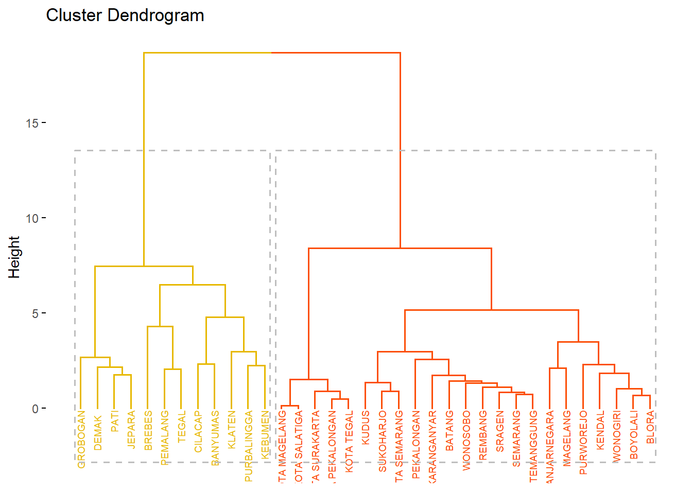
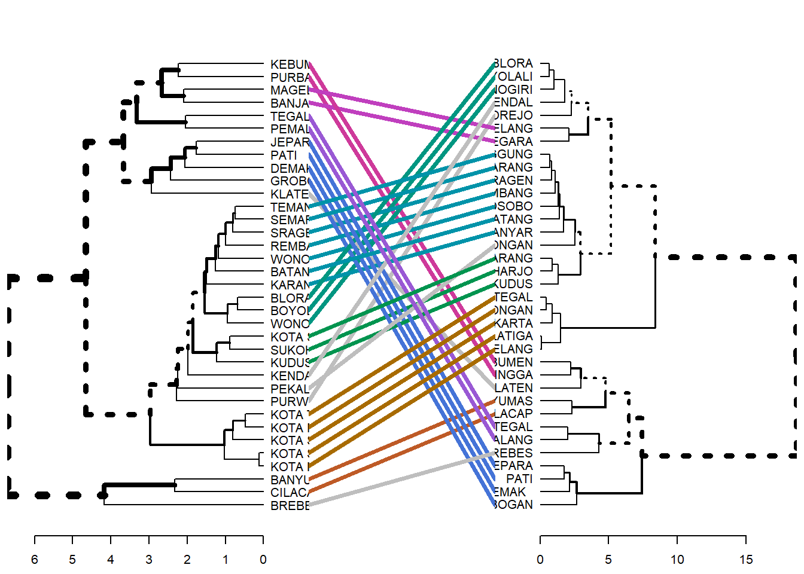
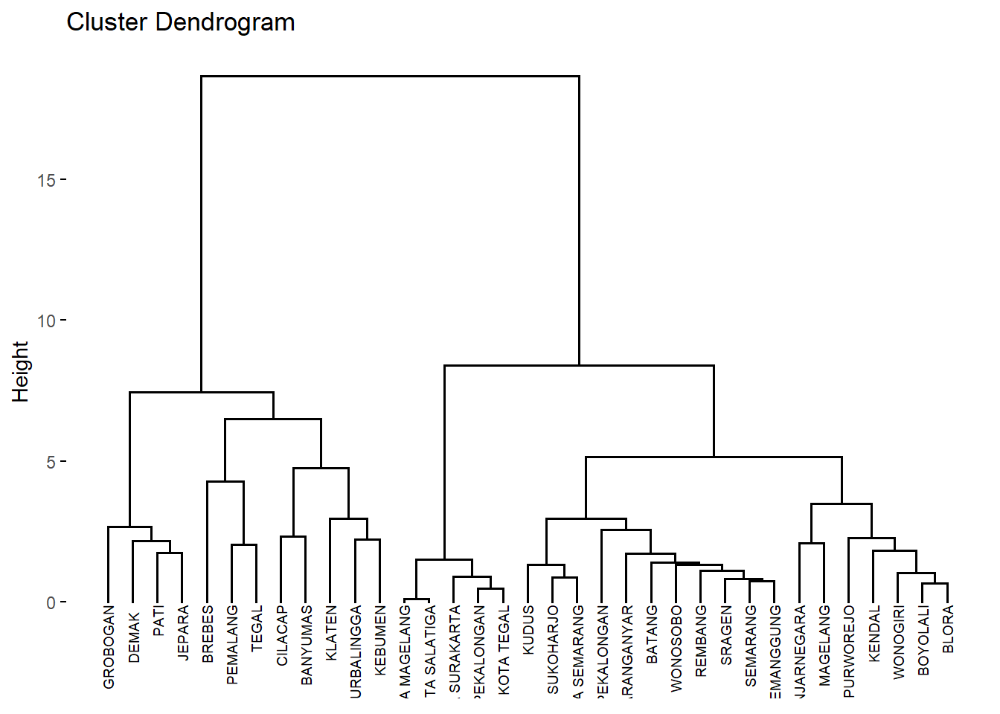
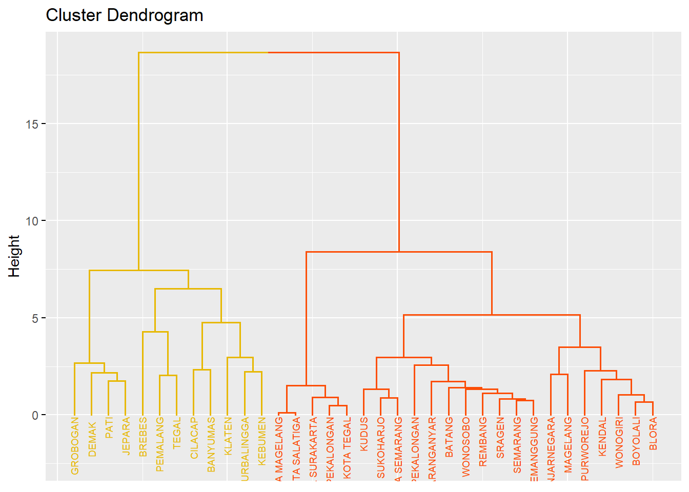
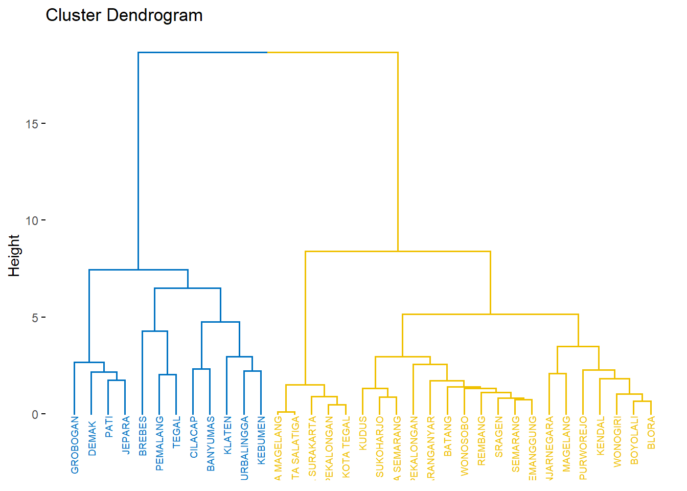
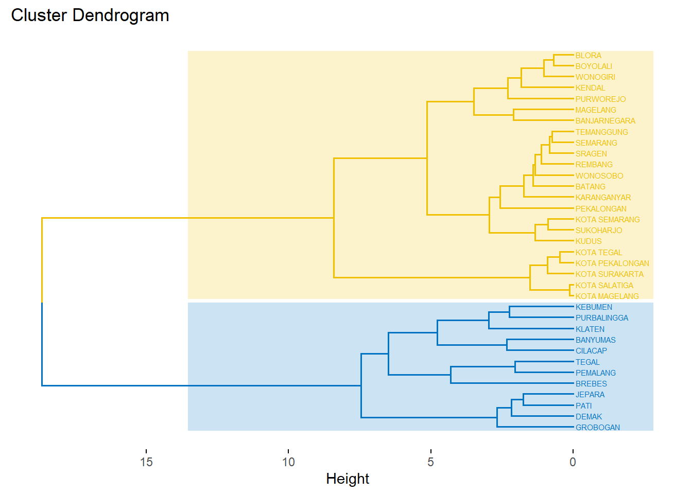

# Metode Cluster Hirarki

## Data

``` r
library (readr)
urlfile = "https://raw.githubusercontent.com/dedenistiawan/Dataset/main/Basis%20Data%20Terpadu%20Jateng.csv"

data<-read.csv(url(urlfile), row.names = "Kabupaten")
```


``` r
knitr::kable(
  head(data, 10), caption = 'Basis Data Terpadu Jawa Tengah',
  booktabs = TRUE)
```


Table: (\#tab:nice-tab)Basis Data Terpadu Jawa Tengah

                  X1     X2     X3     X4     X5     X6      X7     X8     X9    X10
-------------  -----  -----  -----  -----  -----  -----  ------  -----  -----  -----
CILACAP         5.19   5.67   5.08   5.44   5.22   6.05   11.47   9.78   5.55   5.12
BANYUMAS        5.71   4.47   5.18   5.51   5.02   6.21    7.39   6.96   5.98   8.22
PURBALINGGA     3.30   2.19   3.80   3.13   3.73   3.34    8.71   7.41   3.21   4.65
BANJARNEGARA    2.73   2.34   3.76   2.80   2.57   2.99    3.31   5.45   4.21   6.05
KEBUMEN         4.17   2.55   3.26   4.16   3.15   4.15    4.30   9.29   4.61   4.34
PURWOREJO       1.87   2.12   1.48   3.05   1.78   1.83    5.00   4.90   3.12   2.09
WONOSOBO        2.13   1.95   3.00   1.78   1.62   2.06    0.45   2.32   3.57   0.84
MAGELANG        3.95   3.01   4.22   4.15   3.01   3.64    1.44   3.35   5.69   3.67
BOYOLALI        2.19   3.07   1.61   2.74   2.11   1.82    1.71   2.34   3.41   1.55
KLATEN          3.84   5.15   1.93   4.64   4.04   3.78    8.71   4.45   3.99   3.09


``` r
# Standardize the data
df <- scale(data)
```


``` r
# Compute the dissimilarity matrix
# df = the standardized data
res.dist <- dist(df, method = "euclidean")
```


``` r
as.matrix(res.dist)[1:5, 1:5]
```

```
##               CILACAP BANYUMAS PURBALINGGA BANJARNEGARA  KEBUMEN
## CILACAP      0.000000 2.327193    3.828424     5.188508 3.891360
## BANYUMAS     2.327193 0.000000    3.809719     4.232529 3.310710
## PURBALINGGA  3.828424 3.809719    0.000000     2.418211 2.235801
## BANJARNEGARA 5.188508 4.232529    2.418211     0.000000 2.159694
## KEBUMEN      3.891360 3.310710    2.235801     2.159694 0.000000
```


``` r
res.hc <- hclust(d =res.dist, method = "ward.D2")
```


``` r
# cex: label size
library("factoextra")
```

```
## Loading required package: ggplot2
```

```
## Welcome! Want to learn more? See two factoextra-related books at https://goo.gl/ve3WBa
```

``` r
library(ggplot2)
fviz_dend(res.hc, cex = 0.5)
```


``` r
# Cut tree into 2 groups
grp <- cutree(res.hc, k =2)
head(grp, n =2)
```

```
##  CILACAP BANYUMAS 
##        1        1
```

``` r
# Number of members in each cluster
table(grp)
```

```
## grp
##  1  2 
## 12 23
```

``` r
# Cut in 2 groups and color by groups
fviz_dend(res.hc, k =2, # Cut in four groups
          cex = 0.5, # label size
          k_colors = c("#E7B800", "#FC4E07"),
          color_labels_by_k = TRUE, # color labels by groups
          rect = TRUE # Add rectangle around groups)
          )
```




``` r
fviz_cluster(list(data = df, cluster = grp),
palette = c("#E7B800", "#FC4E07"),
ellipse.type = "convex", # Concentration ellipse
repel = TRUE, # Avoid label overplotting (slow)
show.clust.cent = FALSE, ggtheme = theme_minimal())
```


## Comparing dendrograms

``` r
library(dendextend)
```

```
## 
## ---------------------
## Welcome to dendextend version 1.18.1
## Type citation('dendextend') for how to cite the package.
## 
## Type browseVignettes(package = 'dendextend') for the package vignette.
## The github page is: https://github.com/talgalili/dendextend/
## 
## Suggestions and bug-reports can be submitted at: https://github.com/talgalili/dendextend/issues
## You may ask questions at stackoverflow, use the r and dendextend tags: 
## 	 https://stackoverflow.com/questions/tagged/dendextend
## 
## 	To suppress this message use:  suppressPackageStartupMessages(library(dendextend))
## ---------------------
```

```
## 
## Attaching package: 'dendextend'
```

```
## The following object is masked from 'package:stats':
## 
##     cutree
```

``` r
# Compute distance matrix
res.dist <- dist(df, method = "euclidean")

# Compute 2 hierarchical clusterings
hc1 <- hclust(res.dist, method = "average")
hc2 <- hclust(res.dist, method = "ward.D2")

# Create two dendrograms
dend1 <- as.dendrogram (hc1)
dend2 <- as.dendrogram (hc2)

# Create a list to hold dendrograms
dend_list <- dendlist(dend1, dend2)
```


``` r
tanglegram(dend1, dend2)
```



``` r
tanglegram(dend1, dend2,
highlight_distinct_edges = FALSE, # Turn-off dashed lines
common_subtrees_color_lines = FALSE, # Turn-off line colors
common_subtrees_color_branches = TRUE, # Color common branches
main = paste("entanglement =", round(entanglement(dend_list), 2))
)
```


``` r
# Create multiple dendrograms by chaining
dend1 <- df %>% dist %>% hclust("complete") %>%as.dendrogram
dend2 <- df %>% dist %>% hclust("single") %>%as.dendrogram
dend3 <- df %>% dist %>% hclust("average") %>%as.dendrogram
dend4 <- df %>% dist %>% hclust("centroid") %>%as.dendrogram
# Compute correlation matrix
dend_list <- dendlist("Complete" = dend1, "Single" = dend2,
"Average" = dend3, "Centroid" = dend4)
cors <- cor.dendlist(dend_list)
# Print correlation matrix
round(cors, 2)
```

```
##          Complete Single Average Centroid
## Complete     1.00   0.65    0.79     0.58
## Single       0.65   1.00    0.87     0.84
## Average      0.79   0.87    1.00     0.94
## Centroid     0.58   0.84    0.94     1.00
```

``` r
# Visualize the correlation matrix using corrplot package
library(corrplot)
```

```
## Warning: package 'corrplot' was built under R version 4.4.1
```

```
## corrplot 0.95 loaded
```

``` r
corrplot(cors, "pie", "lower")
```


``` r
# Compute distances and hierarchical clustering
dd <- dist(scale(data), method = "euclidean")
hc <- hclust(dd, method = "ward.D2")
```


``` r
library(factoextra)
fviz_dend(hc, cex = 0.5)
```



``` r
fviz_dend(hc, cex = 0.5,
main = "Dendrogram - ward.D2",
xlab = "Objects", ylab = "Distance", sub = "")
```


``` r
fviz_dend(hc, cex = 0.5, horiz = TRUE)
```


``` r
fviz_dend(hc, k =2,
# Cut in four groups
cex = 0.5,
# label size
k_colors = c("#E7B800", "#FC4E07"),
color_labels_by_k = TRUE, # color labels by groups
ggtheme = theme_gray()
# Change theme
)
```



``` r
fviz_dend(hc, cex = 0.5, k =2, # Cut in four groups
k_colors = "jco")
```



``` r
fviz_dend(hc, k =2, cex = 0.4, horiz = TRUE, k_colors = "jco",
rect = TRUE, rect_border = "jco", rect_fill = TRUE)
```



``` r
fviz_dend(hc, cex = 0.5, k =2,
k_colors = "jco", type = "circular")
```


``` r
require("igraph")
```

```
## Loading required package: igraph
```

```
## Warning: package 'igraph' was built under R version 4.4.1
```

```
## 
## Attaching package: 'igraph'
```

```
## The following objects are masked from 'package:stats':
## 
##     decompose, spectrum
```

```
## The following object is masked from 'package:base':
## 
##     union
```

``` r
fviz_dend(hc, k =2, k_colors = "jco",
type = "phylogenic", repel = TRUE)
```


``` r
require("igraph")
fviz_dend(hc, k =2, # Cut in four groups
k_colors = "jco",
type = "phylogenic", repel = TRUE,
phylo_layout = "layout.gem")
```


